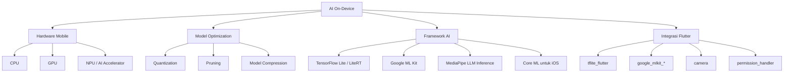

# Dekomposisi_P15_23343082_RendiAigoBrandon

## Aktivitas Dekomposisi  
### Analisis Mendalam Tren dan Roadmap Mobile AI Developer

**Nama:** Rendi Aigo Brandon  
**NIM:** 23343082  
**Mata Kuliah:** Mobile Programming Lanjutan  
**Pertemuan:** 15  
**Topik:** Tren Terkini Mobile Computing  
**Tren yang Dipilih:** AI on-device  
**Format Dokumentasi:** GitHub README.md / Notion  

---

## 1. Pendahuluan

Perkembangan mobile computing saat ini tidak hanya berfokus pada tampilan aplikasi, performa UI, atau integrasi API, tetapi juga mulai mengarah pada kemampuan aplikasi untuk menjadi lebih cerdas. Salah satu tren yang paling relevan dengan masa depan pengembangan aplikasi mobile adalah **AI on-device**, yaitu penerapan kecerdasan buatan yang dijalankan langsung di perangkat pengguna seperti smartphone atau tablet.

Tren ini dipilih karena memiliki hubungan yang kuat dengan Flutter dan peluang karier sebagai **Mobile AI Developer**. Dengan AI on-device, aplikasi mobile dapat melakukan pemrosesan cerdas seperti pengenalan teks, deteksi objek, klasifikasi gambar, penerjemahan, rekomendasi, hingga chatbot lokal tanpa selalu bergantung pada server cloud. Hal ini sangat penting untuk konteks Indonesia karena masih terdapat perbedaan kualitas jaringan internet antarwilayah, variasi spesifikasi perangkat, dan kebutuhan privasi data pengguna.

---

## 2. Dekomposisi Mendalam Tren AI On-Device

### 2.1 Definisi dan Sejarah Singkat

**AI on-device** adalah konsep menjalankan model kecerdasan buatan langsung pada perangkat pengguna, bukan sepenuhnya mengirim data ke server cloud untuk diproses. Pada pendekatan tradisional, aplikasi mobile biasanya mengirim data pengguna ke server, lalu server melakukan proses AI dan mengembalikan hasilnya. Pada AI on-device, proses inferensi dilakukan di dalam perangkat sehingga respons aplikasi bisa lebih cepat, tetap berjalan dalam kondisi offline, dan lebih aman untuk data sensitif.

Secara historis, AI di perangkat mobile mulai berkembang dari fitur sederhana seperti face detection pada kamera, auto-focus, barcode scanning, dan klasifikasi gambar. Perkembangannya semakin kuat setelah perangkat mobile memiliki prosesor yang lebih cepat, GPU yang lebih baik, serta akselerator AI seperti NPU. Selain itu, teknologi kompresi model seperti quantization dan pruning membuat model AI dapat dibuat lebih kecil sehingga memungkinkan dijalankan pada smartphone.

Dalam beberapa tahun terakhir, AI on-device berkembang dari sekadar computer vision menuju generative AI ringan. Model bahasa berukuran kecil mulai dapat dijalankan pada perangkat tertentu untuk kebutuhan seperti ringkasan teks, pencarian lokal, dan chatbot offline. Hal ini menunjukkan bahwa masa depan aplikasi mobile tidak hanya menjadi client dari server, tetapi juga dapat menjadi tempat pemrosesan cerdas secara mandiri.

---

### 2.2 Teknologi Pemungkin

AI on-device dapat berjalan karena adanya kombinasi antara perangkat keras, framework machine learning, dan dukungan integrasi ke aplikasi mobile.



Beberapa teknologi utama yang memungkinkan AI on-device adalah:

| Teknologi | Fungsi |
|---|---|
| **TensorFlow Lite / LiteRT** | Menjalankan model machine learning yang sudah dikonversi agar ringan dan efisien di perangkat mobile. |
| **Google ML Kit** | Menyediakan fitur AI siap pakai seperti text recognition, barcode scanning, face detection, image labeling, dan translation. |
| **MediaPipe LLM Inference** | Mendukung eksperimen model bahasa besar yang dijalankan langsung di perangkat. |
| **NPU / GPU Delegate** | Mempercepat proses inferensi agar tidak hanya mengandalkan CPU. |
| **Model Compression** | Mengurangi ukuran model agar lebih ringan, cepat, dan tidak terlalu membebani memori. |
| **Flutter Packages** | Menjadi penghubung antara aplikasi Flutter dengan fitur AI on-device. |

---

### 2.3 Contoh Implementasi Nyata

Contoh implementasi AI on-device yang sudah banyak ditemukan pada aplikasi mobile antara lain:

1. **OCR Scanner**  
   Aplikasi dapat membaca teks dari gambar, KTP, struk belanja, nota, kartu nama, atau dokumen. Fitur ini bisa dibuat menggunakan Google ML Kit Text Recognition.

2. **Barcode dan QR Code Scanner**  
   Aplikasi kasir, inventaris, dan ticketing dapat membaca barcode atau QR secara langsung dari kamera tanpa perlu server.

3. **Face Detection dan Pose Detection**  
   Digunakan pada aplikasi kesehatan, olahraga, absensi, keamanan, dan filter kamera.

4. **Object Detection**  
   Aplikasi dapat mengenali objek tertentu, misalnya produk toko, jenis tanaman, sampah organik/anorganik, atau komponen industri.

5. **On-device Translation**  
   Aplikasi dapat menerjemahkan teks secara lokal sehingga tetap dapat digunakan saat koneksi internet terbatas.

6. **Chatbot Offline Ringan**  
   Pada perangkat yang mendukung, aplikasi dapat menyediakan asisten lokal untuk menjawab pertanyaan dasar, membuat ringkasan, atau membantu navigasi aplikasi.

Contoh ide implementasi dengan Flutter:

```dart
import 'package:google_mlkit_text_recognition/google_mlkit_text_recognition.dart';

class OcrService {
  final TextRecognizer _recognizer =
      TextRecognizer(script: TextRecognitionScript.latin);

  Future<String> recognizeTextFromImage(String imagePath) async {
    final inputImage = InputImage.fromFilePath(imagePath);
    final RecognizedText result =
        await _recognizer.processImage(inputImage);

    return result.text;
  }

  Future<void> dispose() async {
    await _recognizer.close();
  }
}
```

Kode di atas menunjukkan konsep sederhana penggunaan OCR pada Flutter. Aplikasi mengambil gambar, mengubahnya menjadi `InputImage`, lalu memprosesnya menggunakan `TextRecognizer`. Hasil akhirnya berupa teks yang berhasil dikenali dari gambar.

---

### 2.4 Peluang untuk Developer Flutter

AI on-device membuka peluang besar bagi developer Flutter karena Flutter dapat digunakan untuk membuat aplikasi lintas platform dengan satu basis kode. Artinya, developer dapat mengembangkan aplikasi Android dan iOS dengan UI yang konsisten, lalu menambahkan fitur AI melalui package yang tersedia.

Peluang yang dapat dimanfaatkan developer Flutter antara lain:

- **Aplikasi produktivitas cerdas**, seperti scanner dokumen, pencatat otomatis, dan pengelola tugas dengan rekomendasi.
- **Aplikasi pendidikan**, misalnya OCR untuk membaca soal, aplikasi belajar bahasa, atau kuis adaptif.
- **Aplikasi kesehatan digital**, seperti deteksi pose olahraga, pengingat obat, atau analisis gambar sederhana.
- **Aplikasi UMKM**, misalnya pembaca nota, pencatatan stok otomatis, dan kasir dengan barcode scanner.
- **Aplikasi pertanian**, seperti klasifikasi tanaman, deteksi penyakit daun, atau pencatatan hasil panen berbasis kamera.
- **Aplikasi aksesibilitas**, seperti pembaca teks untuk pengguna dengan keterbatasan penglihatan.

Bagi mahasiswa atau junior developer, tren ini juga cocok dijadikan portofolio karena dapat ditampilkan secara nyata melalui demo aplikasi, video, screenshot, dan repository GitHub.

---

### 2.5 Tantangan Adopsi di Indonesia

Walaupun AI on-device memiliki potensi besar, penerapannya di Indonesia memiliki beberapa tantangan.

Pertama, **fragmentasi perangkat** masih menjadi masalah. Tidak semua pengguna memiliki smartphone dengan spesifikasi tinggi. Banyak perangkat entry-level memiliki RAM, penyimpanan, dan prosesor terbatas. Hal ini membuat developer harus memilih model yang ringan serta melakukan pengujian pada berbagai jenis perangkat.

Kedua, **ukuran aplikasi dapat membesar** karena model AI biasanya ditambahkan sebagai file aset. Jika ukuran aplikasi terlalu besar, pengguna mungkin enggan mengunduhnya, terutama yang memiliki keterbatasan kuota internet atau penyimpanan.

Ketiga, **konsumsi baterai dan suhu perangkat** perlu diperhatikan. Inferensi AI, terutama pada kamera real-time atau model besar, dapat membuat baterai lebih cepat habis dan perangkat menjadi panas.

Keempat, **akurasi model pada konteks lokal** juga menjadi tantangan. Model global belum tentu optimal untuk bahasa daerah, variasi dokumen lokal, kualitas kamera murah, atau kondisi pencahayaan yang berbeda.

Kelima, **kompetensi developer** masih perlu ditingkatkan. Developer Flutter tidak cukup hanya memahami widget dan UI, tetapi juga perlu memahami dasar machine learning, pengelolaan model, performa aplikasi, privasi data, dan pengujian.

---

### 2.6 Proyeksi 3–5 Tahun ke Depan

Dalam 3–5 tahun ke depan, AI on-device diproyeksikan menjadi fitur standar pada banyak aplikasi mobile. Aplikasi tidak lagi hanya menampilkan data, tetapi juga akan membantu pengguna mengambil keputusan, memahami konteks, dan melakukan otomatisasi sederhana.

Prediksi perkembangan AI on-device:

1. **Hybrid AI akan menjadi pola utama**  
   Aplikasi akan menggabungkan AI lokal dan AI cloud. Tugas ringan seperti OCR, klasifikasi sederhana, dan rekomendasi lokal berjalan di perangkat, sedangkan tugas berat tetap diproses di server.

2. **Model kecil semakin kuat**  
   Model bahasa berukuran kecil akan semakin efisien sehingga dapat berjalan di lebih banyak smartphone kelas menengah.

3. **Flutter semakin relevan untuk prototyping AI mobile**  
   Flutter memungkinkan developer membuat UI cepat, menguji integrasi AI, dan membuat produk lintas platform tanpa membangun dua aplikasi terpisah.

4. **Privasi menjadi nilai jual utama**  
   Aplikasi yang mampu memproses data sensitif di perangkat akan lebih dipercaya, terutama pada sektor kesehatan, keuangan, pendidikan, dan identitas digital.

5. **Kebutuhan Mobile AI Developer meningkat**  
   Perusahaan akan membutuhkan developer yang mampu menggabungkan mobile engineering, AI integration, UI/UX, dan pemahaman performa perangkat.

---

## 3. Roadmap Menjadi Mobile AI Developer

### 3.1 Keahlian Dasar Flutter yang Sudah Dimiliki

Untuk menjadi Mobile AI Developer, dasar Flutter yang perlu dikuasai meliputi:

| Keahlian Dasar | Keterangan |
|---|---|
| Dart Fundamental | Variabel, function, class, async-await, null safety. |
| Flutter Widget | StatelessWidget, StatefulWidget, layout, form, navigation. |
| UI/UX Mobile | Membuat tampilan responsif dan mudah digunakan. |
| State Management | Provider, Riverpod, BLoC, atau GetX sesuai kebutuhan project. |
| API Integration | Menghubungkan aplikasi dengan REST API menggunakan http atau dio. |
| Local Storage | SharedPreferences, Hive, SQLite, atau Isar. |
| Asset Management | Menambahkan model `.tflite`, gambar, file JSON, dan konfigurasi ke dalam project. |
| Git dan GitHub | Mengelola versi kode dan membuat dokumentasi portofolio. |
| Debugging | Menggunakan Flutter DevTools, logging, dan profiling performa. |

---

### 3.2 Package yang Perlu Dipelajari

| Package | Fungsi |
|---|---|
| `google_mlkit_text_recognition` | OCR atau pengenalan teks dari gambar. |
| `google_mlkit_barcode_scanning` | Membaca barcode dan QR code. |
| `google_mlkit_face_detection` | Mendeteksi wajah pada gambar atau kamera. |
| `google_mlkit_object_detection` | Deteksi dan tracking objek. |
| `tflite_flutter` | Menjalankan model TensorFlow Lite di Flutter. |
| `camera` | Mengakses kamera untuk input gambar atau video. |
| `image_picker` | Mengambil gambar dari galeri atau kamera. |
| `permission_handler` | Mengelola izin kamera, storage, dan akses perangkat. |
| `image` | Manipulasi gambar sebelum masuk ke model. |
| `path_provider` | Menyimpan atau membaca file lokal. |
| `hive` / `sqflite` | Menyimpan hasil prediksi atau histori lokal. |
| `dio` | Integrasi API jika aplikasi memakai pola hybrid AI. |

---

### 3.3 Proyek Latihan yang Harus Dibuat

| Urutan | Proyek | Tujuan Pembelajaran |
|---|---|---|
| 1 | **OCR Receipt Scanner** | Membaca teks dari struk/nota dan menampilkan hasilnya. |
| 2 | **QR & Barcode Inventory App** | Membuat aplikasi stok barang dengan scanner kode. |
| 3 | **Image Classification App** | Menggunakan model `.tflite` untuk klasifikasi gambar. |
| 4 | **Plant Disease Detector** | Mendeteksi penyakit daun dari gambar sebagai contoh AgriTech. |
| 5 | **AI Notes Assistant** | Menyimpan catatan dan memberi ringkasan atau kategori otomatis. |
| 6 | **Offline Smart Assistant Prototype** | Membuat prototipe asisten lokal sederhana menggunakan model ringan atau integrasi native. |

---

### 3.4 Portofolio yang Dibutuhkan

Portofolio Mobile AI Developer sebaiknya tidak hanya berisi kode, tetapi juga menunjukkan proses berpikir dan kualitas implementasi. Isi portofolio yang disarankan:

1. **Repository GitHub yang rapi**  
   Berisi source code, struktur folder yang jelas, dan commit history yang wajar.

2. **README.md lengkap**  
   Menjelaskan tujuan aplikasi, fitur AI, package yang digunakan, cara menjalankan project, screenshot, dan link demo.

3. **Demo video singkat**  
   Menampilkan aplikasi berjalan di emulator atau perangkat asli.

4. **Dokumentasi performa**  
   Cantumkan ukuran model, waktu inferensi, ukuran APK, dan perangkat yang digunakan untuk pengujian.

5. **Catatan privasi**  
   Jelaskan apakah data diproses secara lokal atau dikirim ke server.

6. **Arsitektur aplikasi**  
   Sertakan diagram sederhana seperti alur input gambar → preprocessing → inferensi → output.

7. **APK atau release build**  
   Sediakan build yang bisa diuji oleh dosen, recruiter, atau pengguna.

---

### 3.5 Target Karier dan Perusahaan di Indonesia

Berikut target karier yang relevan bagi Mobile AI Developer di Indonesia:

| Sektor | Contoh Perusahaan / Target | Alasan Relevan |
|---|---|---|
| HealthTech | Halodoc, Alodokter | Membutuhkan aplikasi mobile dengan fitur cerdas, privasi data, dan pengalaman pengguna yang baik. |
| EdTech | Ruangguru, platform belajar digital, startup edukasi lokal | Cocok untuk OCR soal, rekomendasi materi, chatbot belajar, dan personalisasi pembelajaran. |
| FinTech | DANA, OVO, GoPay, Jenius, Bank digital | Membutuhkan OCR dokumen, verifikasi identitas, deteksi fraud, dan pengalaman mobile yang cepat. |
| Super App / On-demand | Gojek/GoTo, Grab Indonesia | Membutuhkan mobile developer yang memahami performa aplikasi skala besar dan fitur cerdas. |
| AgriTech / IoT | eFishery, startup pertanian presisi, smart farming | Membutuhkan computer vision, pencatatan data lapangan, dan aplikasi offline-first. |
| Konsultan IT / Software House | Software house lokal dan nasional | Cocok sebagai tempat awal membangun pengalaman project Flutter + AI. |

---

## 4. Daftar Sub-Topik Berdasarkan Urgensi dan Tingkat Kesulitan

### 4.1 Fondasi — Wajib Sekarang

| Sub-Topik | Urgensi | Tingkat Kesulitan | Target Output |
|---|---|---|---|
| Dart dan Flutter dasar | Sangat tinggi | Mudah–Menengah | Aplikasi Flutter sederhana dengan navigasi. |
| Widget, layout, form, navigation | Sangat tinggi | Mudah–Menengah | UI aplikasi mobile yang rapi. |
| State management dasar | Tinggi | Menengah | Aplikasi dengan pengelolaan data yang stabil. |
| Local storage | Tinggi | Menengah | Menyimpan hasil analisis AI secara lokal. |
| Camera dan image picker | Sangat tinggi | Menengah | Aplikasi dapat mengambil gambar sebagai input. |
| Permission handling | Tinggi | Mudah | Aplikasi dapat meminta izin kamera/storage. |
| Dasar machine learning | Tinggi | Menengah | Memahami input, model, inferensi, output. |
| GitHub README | Tinggi | Mudah | Dokumentasi portofolio yang siap dinilai. |

---

### 4.2 Menengah — 3 Bulan ke Depan

| Sub-Topik | Urgensi | Tingkat Kesulitan | Target Output |
|---|---|---|---|
| Google ML Kit Text Recognition | Tinggi | Menengah | Aplikasi OCR scanner. |
| Barcode dan QR scanning | Tinggi | Menengah | Aplikasi inventory sederhana. |
| TFLite model integration | Tinggi | Menengah–Sulit | Aplikasi klasifikasi gambar. |
| Preprocessing gambar | Sedang | Menengah | Gambar dapat disesuaikan dengan input model. |
| Performance profiling | Tinggi | Menengah | Mengetahui bottleneck inferensi. |
| Error handling model AI | Tinggi | Menengah | Aplikasi tetap stabil jika prediksi gagal. |
| Clean Architecture sederhana | Sedang | Menengah | Struktur project lebih profesional. |
| Testing dasar | Sedang | Menengah | Unit test dan widget test untuk fitur utama. |

---

### 4.3 Lanjutan — 6 sampai 12 Bulan ke Depan

| Sub-Topik | Urgensi | Tingkat Kesulitan | Target Output |
|---|---|---|---|
| Custom model training | Tinggi | Sulit | Model AI dilatih sesuai dataset sendiri. |
| Quantization dan optimization | Tinggi | Sulit | Model lebih kecil dan cepat. |
| GPU/NPU delegate | Sedang | Sulit | Inferensi lebih optimal pada perangkat tertentu. |
| On-device LLM | Sedang–Tinggi | Sulit | Prototype chatbot lokal. |
| Federated learning concept | Sedang | Sulit | Memahami pembelajaran model tanpa mengirim data mentah. |
| Platform channel Flutter | Tinggi | Sulit | Integrasi fitur native Android/iOS. |
| Security dan privacy AI | Tinggi | Sulit | Aplikasi memiliki kebijakan pemrosesan data yang aman. |
| Publikasi aplikasi | Tinggi | Menengah–Sulit | Aplikasi masuk Play Store/open beta. |

---

## 5. Rencana Belajar 12 Bulan

### Bulan 1–3
- Memperkuat Dart dan Flutter.
- Membuat aplikasi OCR sederhana.
- Mempelajari `google_mlkit_text_recognition`.
- Membuat README dan video demo.
- Mengunggah project ke GitHub.

### Bulan 4–6
- Mempelajari `tflite_flutter`.
- Membuat image classification app.
- Menguji performa aplikasi di perangkat berbeda.
- Mempelajari struktur project yang lebih rapi.
- Menambahkan testing dasar.

### Bulan 7–9
- Mempelajari custom model dan optimasi.
- Membuat project AgriTech atau HealthTech berbasis computer vision.
- Membuat dokumentasi performa dan privasi.
- Mulai membangun profil LinkedIn dan GitHub yang profesional.

### Bulan 10–12
- Mempelajari on-device LLM atau integrasi native.
- Membuat capstone project Mobile AI.
- Mempublikasikan aplikasi dalam bentuk APK/release.
- Melamar magang atau junior mobile developer pada perusahaan target.

---

## 6. Kesimpulan

AI on-device merupakan tren penting dalam mobile computing karena membuat aplikasi mampu memproses data secara cerdas langsung di perangkat pengguna. Keunggulannya terletak pada privasi, kecepatan, kemampuan offline, dan efisiensi biaya server. Bagi developer Flutter, tren ini membuka peluang besar untuk membuat aplikasi lintas platform yang tidak hanya menarik secara tampilan, tetapi juga memiliki kemampuan AI yang praktis.

Untuk menjadi Mobile AI Developer, penguasaan Flutter saja belum cukup. Developer perlu menambahkan kemampuan integrasi package AI, pemahaman dasar machine learning, optimasi performa, pengelolaan model, dan dokumentasi portofolio. Dengan roadmap yang jelas, mahasiswa dapat memulai dari proyek sederhana seperti OCR scanner, lalu berkembang menuju aplikasi AI mobile yang lebih kompleks seperti klasifikasi gambar, deteksi objek, atau asisten offline.

Dalam konteks Indonesia, AI on-device sangat relevan karena dapat membantu mengatasi keterbatasan koneksi internet, meningkatkan privasi data, serta membuka peluang pada sektor kesehatan, pendidikan, keuangan, UMKM, dan pertanian. Oleh karena itu, tren AI on-device layak dijadikan spesialisasi bagi developer Flutter yang ingin mempersiapkan karier di masa depan.

---

## 7. Referensi

- Modul Ajar Mobile Programming Lanjutan Pertemuan 15, Universitas Negeri Padang. Topik: Tren Terkini Mobile Computing: AI on-Device, IoT, PWA, dan Super Apps.
- Google AI Edge. LiteRT: High-performance on-device machine learning. https://ai.google.dev/edge/litert
- Google ML Kit. Text Recognition v2. https://developers.google.com/ml-kit/vision/text-recognition/v2
- Google AI Edge. MediaPipe LLM Inference API. https://ai.google.dev/edge/mediapipe/solutions/genai/llm_inference
- Flutter Documentation. State Management. https://docs.flutter.dev/data-and-backend/state-mgmt
- Flutter Documentation. Assets and Images. https://docs.flutter.dev/ui/assets/assets-and-images
- Pub.dev. tflite_flutter package. https://pub.dev/packages/tflite_flutter
- Pub.dev. google_mlkit_text_recognition package. https://pub.dev/packages/google_mlkit_text_recognition
